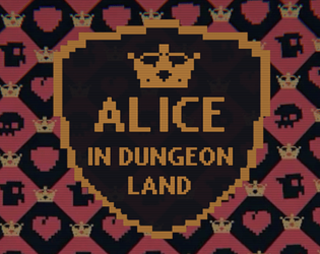
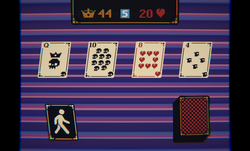
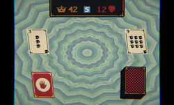

# Alice in Dungeon Land

A quick-and-dirty solitaire dungeon crawler built in Unity! Test your luck, stack your armor, and try to survive a brutal 44-card dungeon deck without getting completely squished.

<p align="center">
  
</p>

**▶ [Play it on itch.io](https://prusiknot.itch.io/alice-in-dungeon-land)**

---

## About

This project is a digital implementation of **Scoundrel**, the classic tabletop card game originally designed by **Zach Gage** and **Kurt Bieg**.

<p align="center">
  
  
</p>

## How to Play

The goal is straightforward: **clear all 44 cards without letting your Health hit 0.**

Every turn, 4 cards are dealt into the room. You have to face 3 out of the 4 cards before you're allowed to move on to the next room.

- ♠ **Goblins** & ♣ **Skulls** — enemies that smack you for damage equal to their face value.
- ♦ **Armor** — slap it on to reduce incoming damage. Watch out: your armor degrades, then breaks with usage!
- ♥ **Hearts** — heal you for their face value (capped at 20 HP max).
- **Fleeing** — monsters got you cornered? Skedaddle out of the room and kick all 4 cards to the bottom of the deck. Fair warning: no double-dips — you can't flee two rooms in a row.

## Controls

- **Left Click** — select and resolve cards.
- **Pause Menu** — mute the audio or restart when RNG ruins your run.

## Download & Install

Downloads are hosted on itch.io:

- **Windows** — `AID-WIN-Release.zip` (50 MB)
- **macOS** — `AID-MAC-Release.zip` (58 MB)

### Windows

Download the archive, extract it, and play.

### macOS

If macOS blocks the game or says it *"can't be opened"*, use one of these two quick fixes:

**Method 1 — Right-Click Open (fastest)**

1. **Control + Click** (or right-click) `Alice in Dungeon Land.app` in Finder.
2. Select **Open** from the menu.
3. Click **Open** in the security popup.

**Method 2 — If macOS says the app is "Damaged"**

1. Open Terminal (**Cmd + Space**, then type `Terminal`).
2. Type `xattr -cr ` (with a trailing space), then drag the app into the Terminal window and press Enter:

   ```bash
   xattr -cr /path/to/Alice\ in\ Dungeon\ Land.app
   ```

## Credits & Thanks

- **Original Game Design** — based on *Scoundrel* by Zach Gage & Kurt Bieg.
- **Audio** — music by Abstraction and Tallbeard Studios (CC0); sound effects by Olex Mazur.
- **Visuals** — animated backgrounds courtesy of edermuniz.
- **Card Deck Art** — Standard Card Deck by Koalone.
- **Development** — built in Unity by Alhasan Shnoot.

## About This Project

An open-source portfolio project showcasing gameplay systems and WebGL engine deployment in Unity. Highlights:

- A faithful digital port of *Scoundrel*'s ruleset, with **seeded (reproducible) shuffling**.
- A custom **Voronoi sprite-fracturing** system (`Assets/Scripts/SpriteFracturer2D.cs`) that shatters armor sprites into procedural shards at runtime.
- **WebGL deployment** with streaming video backgrounds.

> **Note on card art:** the card face and back images are not included in this repository (they're a licensed asset). To run the project, supply your own card images in `Assets/Resources/` following the existing `{rank}_of_{suit}` naming scheme.

## License

See [LICENSE](LICENSE). Third-party assets (audio, fonts, DOTween, etc.) retain their own licenses.
